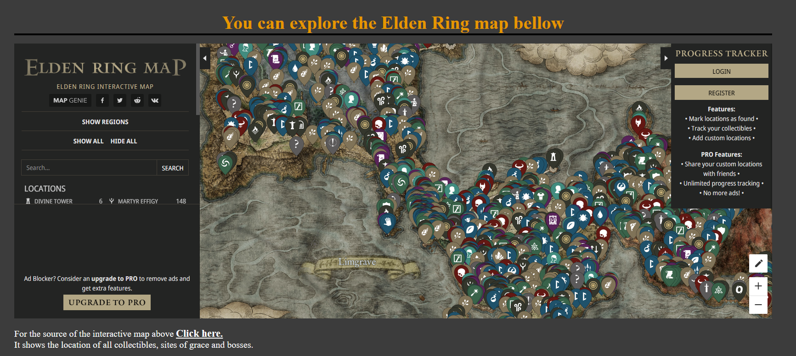

# Elden ring fan site
The elden ring fan site is for gamers looking for their next game to play. Its purpose is to convince the user to give the game a go.

On the overview page there are a few paragraphs on why they should play the game and what makes it so successful and a video on the game they can watch.

The map page has a usable moving and zoomable map with all collectibles locations on it. Website users who are interested in the map can have a look at it or it can be used as a great tool for new players of the game trying to collect everything or find bosses they haven't beaten yet.

The boss page has a tier list of the 3 hardest bosses in the game, a photo of each and a short description of them. Each page is also styled to look good on all screen sizes.

## Website skeleton mockup.

- The overview page  
  

- The map page
  

- The Bosses page
  

# Features.
## The Header.
- The header is simple with the name of the website to let users know what the site is about

- There is also a main image to the page that is from some promotional art for the game.

  

## Navigation.
- At the top of all three pages there is a heading that when clicked brings the user back to the overview page.

- The main 3 navigation buttons are placed below the main image in an easy to see position that responds to the screen size and fits well with the website's theme.

## The overview page.
- The overview page has paragraphs on the left about what made elden ring into the successful game that it is today.

- On the right there are paragraphs on why the user should play the game and give it a try for their next gaming adventure and a video that goes more into depth on why they should play the game.

- The styling on the page is made so that on bigger screens the 2 content sections are side by side. On smaller screens to use all available screen space the margin on the sides are removed and the left section moves above the right section.

## The Map Page.
- The Map page shows a usable map that the user can explore, zoom in and tick and untick the options to show all collectibles, boss locations and sites of grace.

- A user that does decide to try the game could come back to the website and use this map on their first playthrough of the game to help them find anything they need.

- The styling on the page removes the margin on smaller screen sizes but mostly stays the same across devices.

## The bosses page.
- The bosses page has a tier list of widely agreed by the elden ring community the 3 hardest bosses in the game.

- Each boss has its own box with some information on the boss and a picture of the boss to the side.

- The styling for this page removes the margin on smaller screens and makes it so the image of the boss gets smaller and goes below the description instead of to the side to fit better on the smaller screens.

## The footer.
- The footer links to the home page of facebook, instagram and twitter with clickable font awesome icons if this was a page for commercial use it would link to the creators pages.

## Feature left to implement.
- A great feature I could add in the future would be a message board so users of the site could talk to each other, give new player tips and in general get to know other fans of the game.

# Testing

- I tested that the site works on multiple browsers chome, edge and firefox.

- I confirmed that the website looks good and is functional on all standard screen sizes.

- I loaded the website on my phone to ensure the website is usable on even small phone screens.

- I ensured that the overview map and bosses navigation links were all readable, easy to see and click on all screen sizes.

- I confirmed that the youtube video on the overview page does not auto play on the site loading.

## Validator Testing

- The overview page passed all tests on the w3c HTML Checker.

- The Map page passed all tests on w3c HTML Checker with no issues found.

- The Bosses page passed the tests on w3c HTML Checker.

- The style.css passed the w3c CSS Checker with no issues found.

- I made sure the site looks good on all screen sizes using ami.responsive

- I made sure that the website passed accessibility standards using lighthouse

## Fixed Bugs

- I had issues with using python3 -m http.server it would always bring me to the directory instead of my main page.

- I then found out your main page needs to be index.html and I made the change to the file name and the nav links and it solved my issues.

- I had an issue where the highlight style would only work as an id because the p elements was styled as section p which was more specific than class so i changed the styling for p elements on their own which made the class style work and fixed the error from multiple uses of the same id on W3C Validator.

- I had a issue with the images on the 3 bosses section i could'nt seem to get them to go under the text when on a smaller screen size but I eventually managed to figure it out.

## Unresolved Bugs

- All bugs were resolved.

# Deployment
### The site was deployed to GitHub pages. The steps to deploy are as follows:

- In the GitHub repository, navigate to the Settings tab

- From the source section drop-down menu, select the Master Branch

- Once the master branch has been selected, the page will be automatically refreshed with a detailed ribbon display to indicate the successful deployment.

- The live link can be found here - [Click here](https://aaron2134.github.io/Project1-html/)

# Credits

## Sources of information on overview page paragraphs

- https://www.cbr.com/elden-ring-best-game-ever/#elden-ring-has-an-amazing-open-world

- https://www.cnet.com/tech/gaming/why-the-hell-is-elden-ring-so-popular/

- https://ftw.usatoday.com/lists/what-is-elden-ring

- https://eldenring.wiki.fextralife.com/Elden+Ring+Wiki

## Credit to Video Creator - on overview page
- https://www.youtube.com/@BrandSanderson

## What i used to add the videos
- https://support.google.com/youtube/answer/171780?hl=en#:~:text=How%20to%20Embed%20a%20YouTube%20Video%20on%20a,into%20your%20blog%20or%20website%20HTML.%20See%20More.

## Sources of informations on map page paragraphs
- https://eldenring.wiki.fextralife.com/Maps

- https://www.ign.com/wikis/elden-ring/How_to_Reveal_the_Elden_Ring_Map

- https://www.youtube.com/watch?v=Kh0TcNNXYYk

## Credit for the interactive map
- https://mapgenie.io/elden-ring/maps/the-lands-between

## I Used guides from here for the interactive map
- https://www.w3schools.com/html/html_iframe.asp#:~:text=The%20HTML%20%3Ciframe%3E%20tag%20specifies%20an%20inline%20frame,border%3Anone%3B%20to%20remove%20the%20border%20around%20the%20iframe

## All the information on the 3 hardest bosses was taken from here
- https://www.denofgeek.com/games/hardest-elden-ring-boss-fights-tough-difficult/

## some inspiration for the website design
- https://eldenring.wiki.fextralife.com/Elden+Ring+Wiki

## Some code templates used in this project were taken from the love running example website and
- https://www.w3schools.com/Css/default.asp

## I used guides from here for my navigation styling
- https://css-tricks.com/snippets/css/a-guide-to-flexbox/
