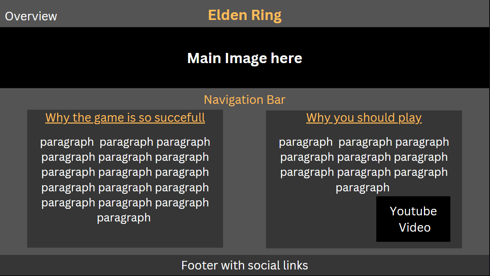
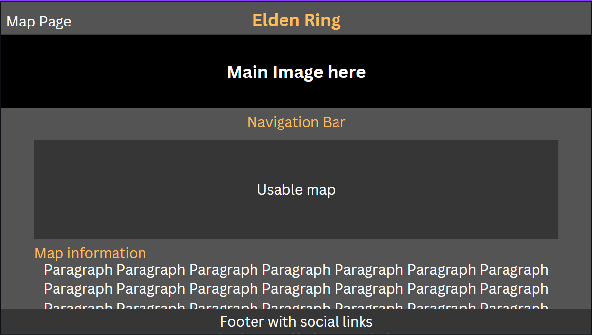
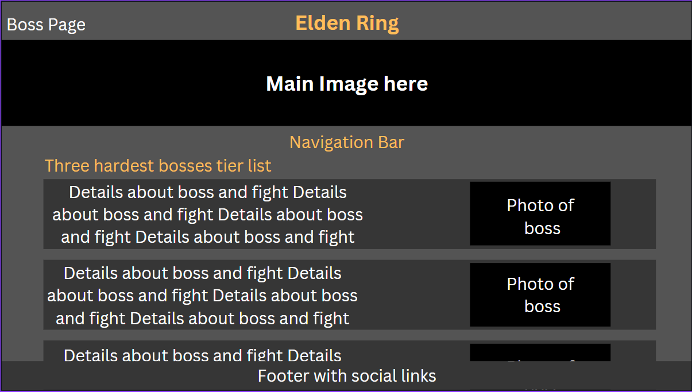
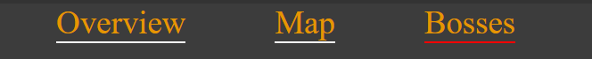
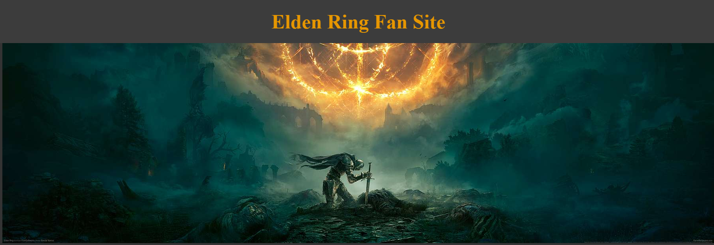
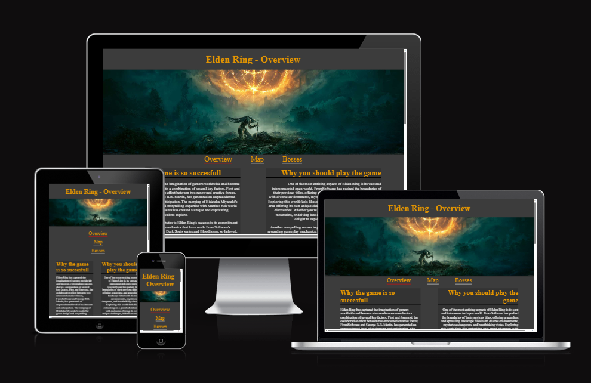
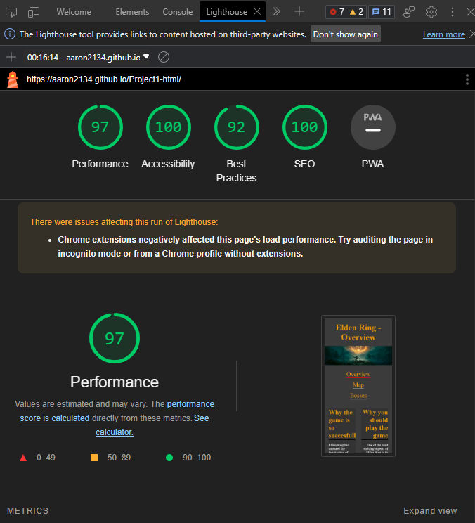

# Read Me

# Website skeleton mockup

- The overview page  
  

- The map page
  

- The Bosses page
  

# Features

- ## Navigation
- At the top of the page there is a heading that when clicked brings the user back to the overview page
- The main 3 navigations buttons are placed bellow the main image in a easy to see position that respsonds to the screen size and fit well with the websites theme.

- ## The Header
- The header is simple with the name of the website to let users know what the site is about
- There is also a main image to the page that is from some promotional art for the game.
  

- ## The 3 main pages
- The overview page shows lots of usefull info for the user to enjoy about the Game and tries to convince them why they should give it a go.
- The Map page shows a usable map that the user can explore the world of elden ring in and even use if they did decide to play the game for all the collectables locations.
- The bosses page highlights the 3 hardest bosses in the game a little bit of story about them and describes some of the fights.

- ## The footer
- The footer links to the home page of facebook, instagram and twitter if this was a page for comercial use it would link to the creators pages.

# Testing

- I tested that the site works on multiple browsers chome, edge and firefox.

- I confirmed that the website looks good and is functional on all standard screen sizes.

- I loaded the website on my phone to ensure the website is usable on even small phone screens.

- I ensured that the overview map and bosses navigation links were all readable easy to see and click on all screen sizes.

- I confirmed that the youtube video on the overview page does not auto play on the site loading.

## Validator Testing

- The overview page passed all tests on the w3c HTML Checker.

- The Map page passed all tests on w3c HTML Cheacker with no issues found.

- The Bosses page passed the tests on w3c HTML Checker.

- The style.css passed the w3c CSS Checker with no issues found.

- I made sure the site looks good on all screen sizes using ami.responsive

- I made sure that the website passed accesibility standards using lighthouse

## Fixed Bugs

- I had issues with using python3 -m http.server it would always bring me to directory instead of my main page.

- I then found out your main page needs to be index.html and i made the change to the file name and the nav links and it solved my issues.

- I had an issue where the highlight style would only work as an id because the p elements was styled as section p which was more specific than class so i changed the styling for p elements on their own which made the class style work and fixed the error from multiple uses of the same id on W3C Validator.

- I had a issue with the images on the 3 bosses section i could'nt seem to get them to go under the text when on a smaller screen size but I eventually managed to figure it out.

## Unresolved Bugs

- All bugs were resolved.

# Deployment

- I used github to deploy the site
- Here is the link https://aaron2134.github.io/Project1-html/

# Credits

## Sources of information on overview page paragraphs

https://www.cbr.com/elden-ring-best-game-ever/#elden-ring-has-an-amazing-open-world

https://www.cnet.com/tech/gaming/why-the-hell-is-elden-ring-so-popular/

https://ftw.usatoday.com/lists/what-is-elden-ring

https://eldenring.wiki.fextralife.com/Elden+Ring+Wiki

## Credit to Video Creator - on overview page

https://www.youtube.com/@BrandSanderson

## What i used to add the videos

https://support.google.com/youtube/answer/171780?hl=en#:~:text=How%20to%20Embed%20a%20YouTube%20Video%20on%20a,into%20your%20blog%20or%20website%20HTML.%20See%20More.

## Sources of informations on map page paragraphs

https://eldenring.wiki.fextralife.com/Maps

https://www.ign.com/wikis/elden-ring/How_to_Reveal_the_Elden_Ring_Map

https://www.youtube.com/watch?v=Kh0TcNNXYYk

## Credit for the interactive map

https://mapgenie.io/elden-ring/maps/the-lands-between

## I Used guides from here for the interactive map

https://www.w3schools.com/html/html_iframe.asp#:~:text=The%20HTML%20%3Ciframe%3E%20tag%20specifies%20an%20inline%20frame,border%3Anone%3B%20to%20remove%20the%20border%20around%20the%20iframe

## All the information on the 3 hardest bosses was taken from here

https://www.denofgeek.com/games/hardest-elden-ring-boss-fights-tough-difficult/

## some inspiration for the website design

https://eldenring.wiki.fextralife.com/Elden+Ring+Wiki

## Some code templates used in this project were taken from the love running example website and

https://www.w3schools.com/Css/default.asp

## I used guides from here for my navigation styling

https://css-tricks.com/snippets/css/a-guide-to-flexbox/
